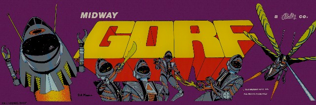
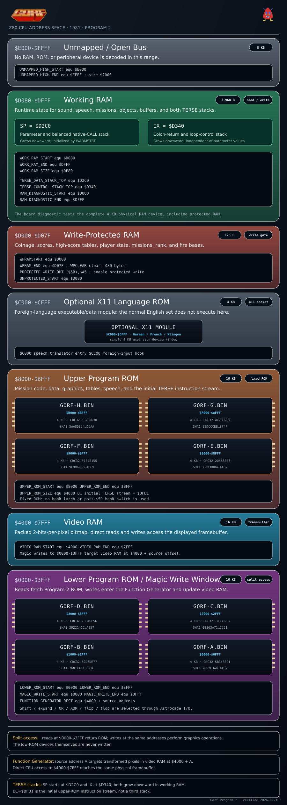
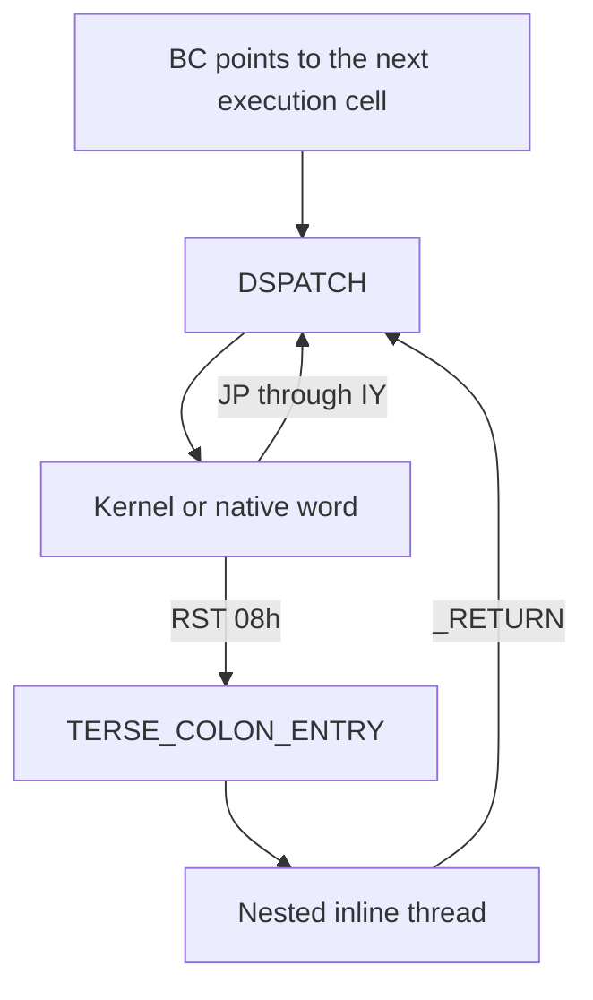
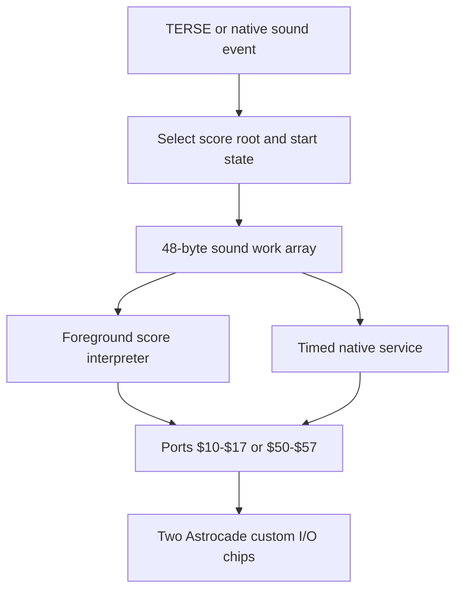
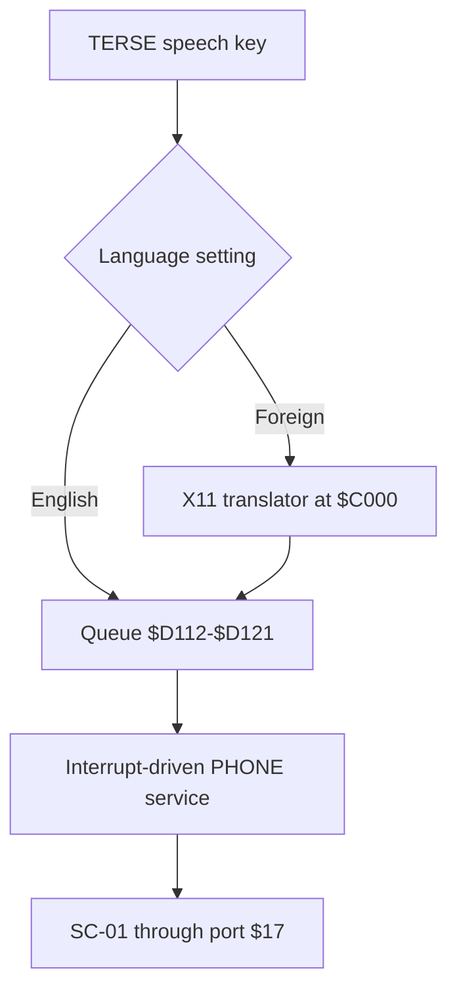

# Gorf

This project reconstructs the Z80 and TERSE source for **Gorf Program 2**,
developed at Dave Nutting Associates (DNA) and released by Bally Midway in
1981. It builds the eight 4 KB CPU ROMs byte for byte and packages them for
MAME.



Gorf joins five distinct shooting missions into one ranked campaign. Finishing
the cycle increases the player's rank and difficulty before the missions begin
again. The cabinet's synthesized voice supplies mission announcements, rank
calls, warnings, and taunts throughout the game.

The game runs on DNA's commercial Astrocade platform: a Zilog Z80, a 16 KB
packed-pixel framebuffer, the Astrocade Function Generator and pattern-board
hardware, two Astrocade custom I/O chips with programmable sound generators,
and a Votrax SC-01 speech synthesizer. An optional 4 KB X11 ROM translates
resident speech keys for foreign-language sets.

Most foreground game control is written in **TERSE**, DNA's direct-threaded
Z80 language created by Alan McNeil. Native Z80 routines provide the runtime,
interrupt service, graphics, sound, speech, input, and board interfaces used by
the threaded mission code.

The original Gorf development credits list:

- Dave Nutting — executive producer, game concept, and design
- Jamie Fenton — game concept, design, and video programming
- Scot Norris — audio programming
- Rick Frankel and Bob Ogden — program support
- Jeff Frederickson and Dave Otto — electronics

This repository builds on the Program-2 disassembly by Commander Dave, aka
`tinymouse42`.

|  |  |
| --- | --- |
| [ROM identity and build](#rom-organization) | zmac 1.3 produces eight 4 KB Program-2 ROMs and the build scripts verify every SHA1 before packaging. |
| [TERSE](#terse-execution-architecture) | Dispatch, colon entry and return, register ownership, inline formats, and the native-word continuation contract are documented. |
| [Memory](#ram-and-io-ownership) | The complete CPU address space, protected RAM, known sound and speech ranges, and both TERSE stack anchors are mapped. Priority 2 assigns the remaining RAM bytes. |
| [Video hardware](#function-generator-and-video-hardware) | ROM-read/Magic-write behavior, direct video RAM, Function Generator control, expansion color, and pattern-board ports are identified. Priority 3 traces the complete raster path. |
| [Sound](#sound-architecture) | Both custom I/O-chip sound generators, their 48-byte work arrays, the score interpreter, 20 audible events, and 24 score roots are mapped. |
| [Speech](#speech-architecture) | The English SC-01 records, interrupt-driven queue, compound phrases, and Program-2 X11 translation contract are mapped. |
| [RE priorities](#reverse-engineering-status) | Code/data boundaries, RAM ownership, hardware control, graphics, progression, missions, diagnostics, and regression work are ordered by dependency. |

## Game structure

The player-visible mission order is:

1. Astro Battles
2. Laser Attack
3. Galaxians
4. Space Warp
5. Flag Ship

The source names the Astro Battles module **Invaders** and the Laser Attack
module **Attack Fighter**. Priority 6 will reconcile every internal mission
number with the player-visible order while tracing each module from entry to
exit.

Destroying the Flag Ship promotes the player through Space Cadet, Space
Captain, Space Colonel, Space General, Space Warrior, and Space Avenger. Rank
is stored in protected RAM and controls both gameplay difficulty and speech
selection.

<!-- DIAGRAM PLACEHOLDER (Priorities 5-6): Add the verified attract, coin/start, player-swap, mission, promotion, death, and game-over state graph. -->

## Project layout

| Path | Contents |
| --- | --- |
| `src/Gorf_Disassembly.asm` | Program-2 native Z80, TERSE runtime, threaded game code, and resident data |
| `src/german/GERMAN_X11.asm` | Program-2 German X11 adaptation |
| `src/french/FRENCH_X11.asm` | Program-2 French X11 adaptation |
| `src/klingon/KLINGON_X11.asm` | Experimental Program-2 Klingon X11 adaptation |
| `build.sh` | Linux assembly, ROM splitting, SHA1 verification, and packaging |
| `build.bat` | Windows assembly, ROM splitting, SHA1 verification, and packaging |
| `roms/original/gorf.zip` | Reference Program-2 CPU ROM archive |
| `docs/TERSE_ARCHITECTURE.md` | Gorf direct-threaded runtime contract |
| `docs/SOUND_MAP.md` | Astrocade custom I/O-chip sound generators, bytecode, and event catalog |
| `docs/SPEECH_MAP.md` | English speech records, selectors, queue, and X11 requirements |
| `docs/RE_PRIORITY.md` | Ordered reverse-engineering work plan |
| `images/gorf-marquee.jpg` | Gorf marquee used by this README |
| `images/gorf-memory-map.png` | 64 KB CPU memory map |

`TERSE_Naming_Guidelines.md` and `TERSE_81_verbs_index.md` define the broader
TERSE naming policy and original vocabulary used in the source.

## Build

This source is built with Bruce Norskog's **zmac 1.3**. The scripts resolve
zmac from `ZMAC`, the bundled `tools/` executable, or `PATH`. Linux also
requires `zip`; Windows uses PowerShell for ROM extraction and packaging.

The SC-01 image must be present as `roms/sc01.bin`.

Linux:

```sh
./build.sh
```

Windows 10/11:

```bat
build.bat
```

Optional Program-2 language builds are mutually exclusive:

```sh
./build.sh --german
./build.sh --french
./build.sh --klingon
```

The same options are accepted by `build.bat`.

Each script performs the same four steps:

1. Assemble `src/Gorf_Disassembly.asm` and the selected X11 source.
2. Extract the eight populated 4 KB CPU ranges without packaging the video-RAM
   gap.
3. Verify every generated Program-2 CPU ROM against its reference SHA1 and
   stop on a mismatch.
4. Package the CPU ROMs and `sc01.bin` for MAME.

Generated English-set files:

```text
src/zout/Gorf_Disassembly.cim       # Linux combined image
src/zout/Gorf_Disassembly.hex       # Windows combined image
src/zout/Gorf_Disassembly.lst
roms/gorf-a.bin
roms/gorf-b.bin
roms/gorf-c.bin
roms/gorf-d.bin
roms/gorf-e.bin
roms/gorf-f.bin
roms/gorf-g.bin
roms/gorf-h.bin
roms/gorf.zip
```

## Run in MAME

Run the English Program-2 set from the project ROM directory:

```sh
mame gorf -rompath roms
```

The language targets use MAME's existing foreign-set containers:

```sh
mame gorfpgm1g -rompath roms   # German or Klingon compatibility archive
mame gorfpgm1f -rompath roms   # French compatibility archive
```

Select **Foreign** for the cabinet Language setting. The language READMEs
describe the Program-2/X11 packaging and the expected MAME audit warnings for
these compatibility archives.

## ROM organization

The Program-2 image occupies two fixed 16 KB ROM regions. `$4000-$7FFF` is
video RAM and is not packed into the CPU ROM archive.

| ROM | CPU range | CRC32 | SHA1 |
| --- | ---: | --- | --- |
| `gorf-a.bin` | `$0000-$0FFF` | `5b348321` | `76e2e3ad1a66755f1a369167fdb157690fd44a52` |
| `gorf-b.bin` | `$1000-$1FFF` | `62d6de77` | `2601faf12d0ab4972c5535ffd722b03ecd8c097c` |
| `gorf-c.bin` | `$2000-$2FFF` | `1d3bc9c9` | `0b363a71d7585a4828e08668ebb2999c55e02721` |
| `gorf-d.bin` | `$3000-$3FFF` | `70046e56` | `392214cc6ed4155bfe022d36f0f86c2594a5ab57` |
| `gorf-e.bin` | `$8000-$8FFF` | `2d456eb5` | `720fb8b48e20c1fc281d8804259016c3c5364a07` |
| `gorf-f.bin` | `$9000-$9FFF` | `f7e4e155` | `9c9d6d3bfee6556dc7a01de81d6148dd02f04fc9` |
| `gorf-g.bin` | `$A000-$AFFF` | `4e2bd9b9` | `9edccceea5af015275582553ed238c40c73d8f4f` |
| `gorf-h.bin` | `$B000-$BFFF` | `fe7b863d` | `5aa8d824814ee1c30eaf0044da78d3aa8220dcaa` |

The 64 KB map shows the different read and write paths, physical ROM devices,
video RAM, the X11 socket, protected RAM, working RAM, and TERSE stack anchors.



## TERSE execution architecture

Gorf uses a direct-threaded TERSE engine. Each execution cell is a
little-endian native Z80 address. `DSPATCH` reads the address through `BC`,
advances `BC` to the next cell, and jumps directly to the selected kernel or
application word. TERSE is the foreground control architecture for the game,
not an isolated scripting layer.



### Register model and dispatch ABI

| Register/address | TERSE ownership |
| --- | --- |
| `BC` | Threaded instruction pointer; addresses the next execution cell or the current word's inline operand |
| `SP=$D2C0` | Downward-growing 16-bit parameter stack; also used by balanced native `CALL`, `RET`, and `PUSH` operations |
| `IX=$D340` | Downward-growing control stack for nested-thread return IPs and loop state |
| `IY=DSPATCH` | Native-word continuation; normal native words return with `JP (IY)` |
| `HL`, `DE`, `AF` | Native scratch registers unless a word documents a narrower contract |
| `BC=$BFB1` at startup | Initial threaded instruction stream in upper ROM; this is not a RAM stack |

### Colon calls and returns

A compiled colon definition begins with `RST $08`. The RST instruction pushes
the nested thread address on SP. `TERSE_COLON_ENTRY` immediately pops it into
`BC`, saves the caller's previous `BC` as a two-byte IX control cell, and
resumes dispatch. `_RETURN` restores the saved threaded IP from IX.

Native primitives normally enter after the dispatcher has advanced `BC` past
their execution cell and return with `JP (IY)`. Compact words preserve the same
two-byte instruction as data:

```asm
DW      TERSE_NEXT_OPCODE       ; bytes FD E9 = JP (IY)
```

### Inline operand formats

| Word | Bytes following the execution cell | Result |
| --- | --- | --- |
| `_LIT` | 16-bit little-endian value | Push one TERSE cell |
| `_LITbyte` | 8-bit value | Push a zero-extended cell |
| `_BARRAY` | 16-bit base address | Form a byte-array reference |
| `_ARRAY` | 16-bit base address | Form a cell-array reference |

The TERSE definition of `_XY` compiles directly into execution cells:

```forth
: XY  100 *  SWAP  40 *  SWAP ;
```

```asm
_XY:        RST     $08
            DW      _LIT, 100, _MUL, _SWAP
            DW      _LIT, 40,  _MUL, _SWAP, _RETURN
```

See [`docs/TERSE_ARCHITECTURE.md`](docs/TERSE_ARCHITECTURE.md) for the runtime
contract and source conventions.

<!-- DIAGRAM PLACEHOLDER (Priority 3): Add the verified reset, interrupt, and foreground-ownership flow after the interrupt/raster audit. -->

## RAM and I/O ownership

### CPU address space

| CPU range | Read | Write | Function |
| --- | --- | --- | --- |
| `$0000-$3FFF` | Program ROMs A-D | Function Generator | Low Program-2 code and data. Writes are transformed by the Magic hardware and applied to video RAM at `$4000 + address`. |
| `$4000-$7FFF` | Video RAM | Video RAM | 16 KB packed bitmap framebuffer. Direct CPU writes bypass the Function Generator. |
| `$8000-$BFFF` | Program ROMs E-H | Ignored | Fixed upper Program-2 code and data; this range is not bank-switched. |
| `$C000-$CFFF` | X11 ROM when fitted | Ignored | Optional foreign-language module. `$C000` is the speech translator entry and `$CC00` is the foreign-input hook. |
| `$D000-$D07F` | RAM | Write gated | Protected coinage, score, high-score, player, mission, rank, and fire-base state. Output `$A5` to port `$5B` before writing. |
| `$D080-$DFFF` | RAM | RAM | Runtime workspace for common state, sound, speech, missions, objects, buffers, and both TERSE stacks. |
| `$E000-$FFFF` | Open bus | Unmapped | No decoded RAM, ROM, or peripheral window. |

The board diagnostic fills and reads the complete `$D000-$DFFF` physical RAM
device. `WPCLEAR` clears `$80` bytes beginning at `WPRAMSTART=$D000`; normal
working RAM begins at `$D080`.

### Known RAM ranges

| Address/range | Owner |
| ---: | --- |
| `$D000-$D07F` | Write-protected bookkeeping, player, score, mission, rank, and fire-base state |
| `$D080-$D0AE` | Common engine workspace; Priority 2 will assign its byte-level ownership |
| `$D0AF` | `MUSICFLAG`, global native music-processor enable |
| `$D0B0` | Sound-service thumper cadence counter |
| `$D0B1-$D0E0` | Primary Astrocade sound work array |
| `$D0E1-$D110` | Secondary Astrocade sound work array |
| `$D111` | `ONHOLD`, delay before speech service resumes |
| `$D112-$D121` | Eight-entry circular queue of 16-bit speech-record pointers |
| `$D122-$D12A` | Active speech pointer, remaining count, queue cursors, and anti-repeat state |
| `$D2C0` | Initial SP position for the TERSE parameter/native-call stack |
| `$D340` | Initial IX position for the TERSE control stack |

Priority 2 will assign the other `$D000-$DFFF` aliases, mission overlays,
object pools, and clear domains, then measure the SP and IX low-water marks.

<!-- DIAGRAM PLACEHOLDER (Priority 2): Add the complete RAM-ownership and measured stack-bounds diagram. -->

### Identified I/O ports

| Port | Function |
| ---: | --- |
| `$0C` | Function Generator Magic control |
| `$10` | Coin, test, and slam-switch input; also within the primary custom I/O chip's sound-register range |
| `$12` | Player controls, including the cocktail second-player input path |
| `$13` | Cabinet settings and Language switch |
| `$15` | Coin-counter and miscellaneous output |
| `$17` | SC-01 phoneme output and primary custom I/O chip sound-register path |
| `$19` | Function Generator expansion-color register |
| `$50-$57` | Secondary Astrocade custom I/O chip sound registers |
| `$5B` | Write-protected RAM enable; output value `$A5` |
| `$78-$7E` | Pattern-board line, area, width, height, and status registers |

## Function Generator and video hardware

The lower 16 KB has split access semantics. Reads at `$0000-$3FFF` fetch ROM;
writes at the same addresses enter the Astrocade Function Generator and modify
the corresponding framebuffer byte at `$4000-$7FFF`. Code can also read or
write video RAM directly through the `$4000-$7FFF` window.

The Function Generator applies the mode selected at port `$0C`, including
rotation, expansion, OR/XOR combining, and flip/flop transforms. Port `$19`
supplies the expansion colors. The pattern-board registers at `$78-$7E`
describe accelerated line and rectangular transfers used by the graphics
engine.

Priority 3 covers the per-frame raster schedule, palette splits, Function
Generator call sites, pattern-board completion behavior, and
foreground/interrupt ownership. Priority 4 covers graphics descriptors and
animation formats.

## Cabinet controls and language option

Gorf uses an eight-way flight control with a trigger. The native input path
reads coin, test, and slam switches at port `$10`, player controls at `$12`,
and cabinet settings at `$13`. The protected bookkeeping area retains credits,
scores, high scores, player count, active player, mission, rank, cocktail mode,
and remaining fire bases.

The Language setting is bit 3 of port `$13`. In English mode, resident speech
records are queued directly. In Foreign mode, Program 2 passes the resident key
to an optional X11 module at `$C000`; the module returns a translated speech
record through the same queue contract. The `$CC00` hook provides the
foreign-mode input service expected by Program 2.

## Sound architecture

Gorf uses the programmable sound generators in two Astrocade custom I/O chips.
Each generator has a 48-byte RAM work array containing register shadows,
timers, score cursors, and synthesis state. Native service routines advance
those arrays and write the sound registers; a foreground interpreter consumes
compact score programs from ROM.



| Custom I/O chip | Sound registers | RAM work array |
| --- | --- | --- |
| Primary | `$10-$17` | `$D0B1-$D0E0` |
| Secondary | `$50-$57` | `$D0E1-$D110` |

The sound map names 20 audible events and 24 ROM score roots. See
[`docs/SOUND_MAP.md`](docs/SOUND_MAP.md) for the register mirrors, score
bytecode, event catalog, and service routines.

## Speech architecture

English speech uses length-prefixed SC-01 records. Each phoneme byte stores the
six-bit phoneme number in bits 0-5 and inflection in bits 6-7. An eight-entry
circular queue at `$D112-$D121` holds 16-bit record pointers; interrupt service
advances the active record and writes phonemes through port `$17`.



Program 2 contains 36 resident English speech keys, including the six rank
fragments used with “Space.” Compound selectors build mission introductions,
warnings, hit reactions, and Flag Ship completion announcements without
duplicating shared fragments.

See [`docs/SPEECH_MAP.md`](docs/SPEECH_MAP.md) for the record inventory, queue
state, selectors, and X11 interface.

## Service diagnostics

The source contains the cabinet service paths and a RAM diagnostic that tests
the complete `$D000-$DFFF` device, including the write-protected subrange.
Priority 7 traces the ROM checks, video and pattern-board tests, input display,
sound and speech checks, failure displays, and operator-switch routing against
the manual and MAME.

<!-- DIAGRAM PLACEHOLDER (Priority 7): Add the verified service-entry and diagnostic decision flow. -->

## Source conventions

- Original TERSE names are used when they match the assembled code.
- New labels describe demonstrated behavior and are not treated as standard
  TERSE vocabulary without supporting evidence.
- Compiled TERSE words and thread-dispatchable native primitives use an
  underscore prefix.
- Native support routines and local labels use lowercase names; variables use
  uppercase names.
- Original block transcriptions remain beside the assembled code when they
  document an implementation detail or ROM/source difference.
- Every edit must preserve the eight Program-2 ROM hashes.

## Reverse-engineering status

The sound and speech subsystems, top-level memory map, TERSE runtime contract,
and reproducible build are documented. The next task is the executable/data
boundary and call-graph audit described in
[`docs/RE_PRIORITY.md`](docs/RE_PRIORITY.md).

The source contains address-only labels, numeric control transfers, and data
ranges rendered as instructions. Priority 1 resolves those boundaries before
the RAM, raster, graphics, progression, mission, and service passes depend on
them. Each completed source slice must assemble to the reference ROMs.

The outstanding README diagrams are tracked with the same priorities:

| Priority | Planned diagram |
| ---: | --- |
| 2 | Complete `$D000-$DFFF` ownership and measured SP/IX bounds |
| 3 | Reset, interrupt, raster, video, and foreground ownership |
| 5-6 | Attract-to-game-over progression and per-mission action graphs |
| 7 | Service-entry and diagnostic decision flow |

## References

### Original development and game history

- [Jamie Fenton — biography](https://www.fentonia.com/bio/)
- [The Ted Dabney Experience — Jamie Fenton interview](https://www.teddabneyexperience.com/episodes/tde/ep02/jamiefenton)
- [Arcade History — Gorf, Model 873](https://www.arcade-history.com/game/991/gorf-model-873)

### Emulator source

- [MAME Astrocade driver](https://github.com/mamedev/mame/blob/master/src/mame/bally/astrocde.cpp)

### Hardware documentation

- [Gorf Parts and Operating Manual, February 1981](https://ballyalley.com/documentation/Arcade_Games/Gorf/Gorf_Parts_and_Operating_Manual_%28Feb_1981%29.pdf)
- [Bally Alley arcade documentation index](https://ballyalley.com/documentation/Arcade_Games/Arcade_Games.html)
